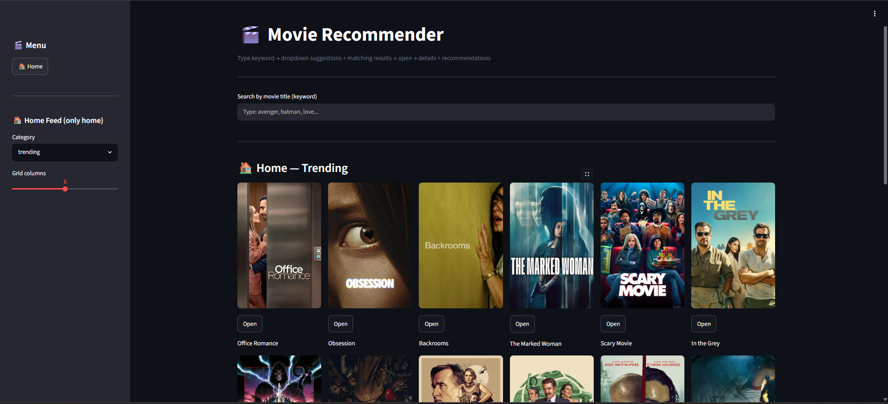
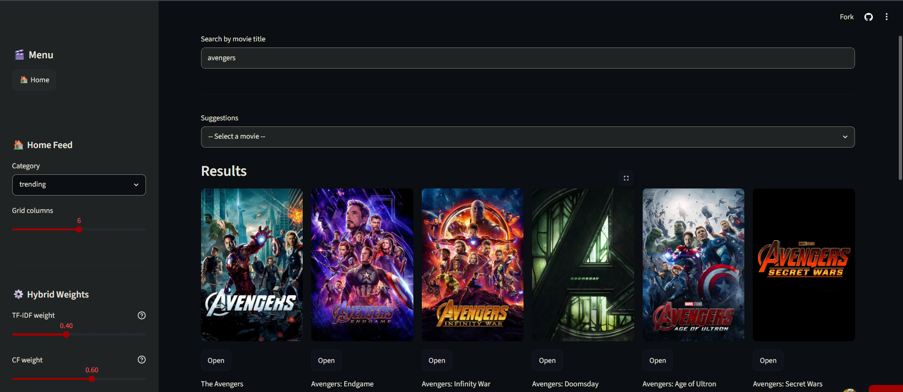
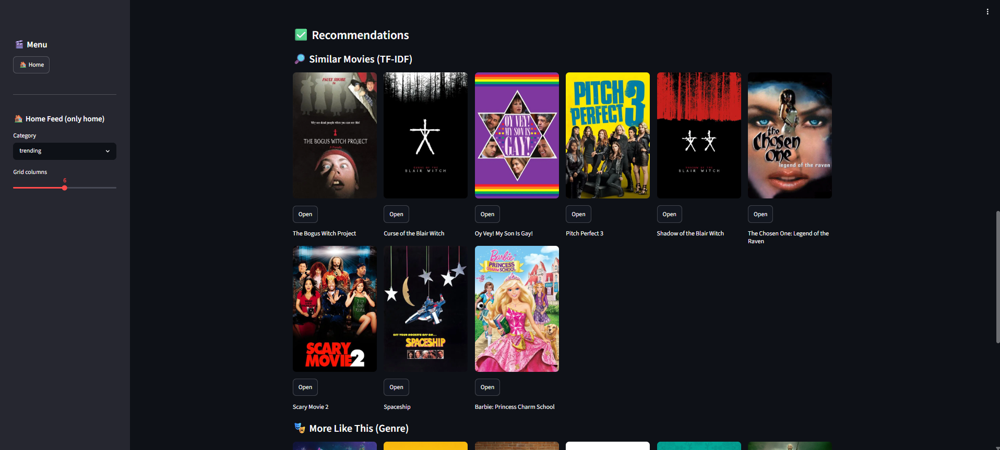
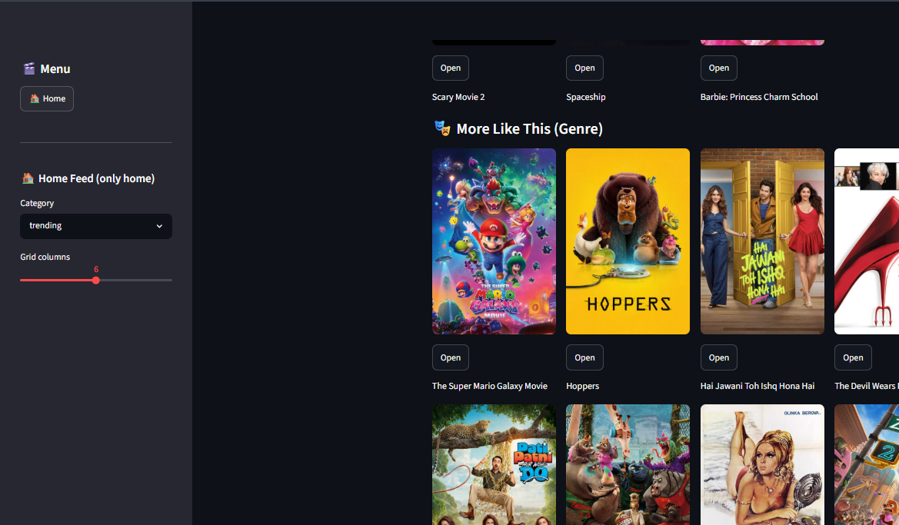
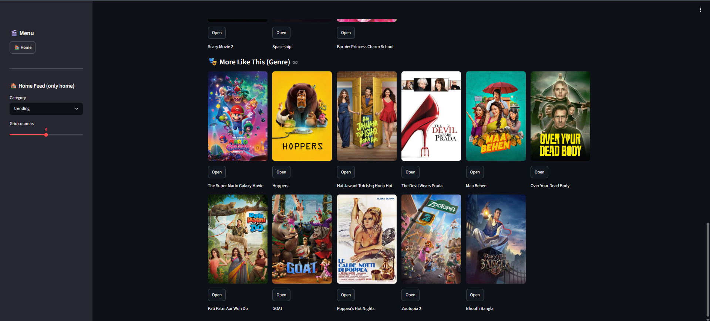

# 🎬 Movie Recommendation System

### TMDB Powered Movie Discovery & Recommendation Engine

---

# 📌 Table of Contents

- [Project Overview](#-project-overview)
- [Business Objectives](#-business-objectives)
- [Data Sources](#-data-sources)
- [Recommendation Engine](#-recommendation-engine)
- [Tech Stack](#-tech-stack)
- [Application](#-application)
- [Project Structure](#-project-structure)
- [How to Run This Project](#-how-to-run-this-project)
- [Author & Contact](#-author--contact)

---

# 🎯 Project Overview

This project implements an end-to-end Movie Recommendation System designed to help users:

1. Search movies using TMDB API.
2. Explore trending and popular movies.
3. Get personalized movie recommendations.
4. Discover similar movies using Machine Learning.
5. View movie posters, ratings, genres, and details.

---

# 🎯 Business Objectives

## 1. Movie Recommendation

### Content-Based Filtering

- TF-IDF Vectorization
- Cosine Similarity
- Similar Movie Discovery

### Genre-Based Recommendation

- TMDB Genre Metadata
- Related Movie Suggestions
- Trending Movies by Category

---

# 🗂️ Data Sources

The project uses:

```text
TMDB API
Movie Metadata Dataset
TF-IDF Feature Matrix
```

---

# 🤖 Recommendation Engine

## Content-Based Recommendation

The recommendation engine uses:

- TF-IDF Vectorizer
- Cosine Similarity
- Movie Tags Processing

Final Recommendation Model:

```text
TF-IDF + Cosine Similarity
```

## Genre-Based Recommendation

Uses TMDB API to fetch:

- Similar Genre Movies
- Trending Movies
- Popular Movies

---

# 🛠️ Tech Stack

## Frontend

- Streamlit

## Backend

- FastAPI
- Uvicorn

## Machine Learning

- Scikit-Learn
- TF-IDF Vectorizer
- Cosine Similarity

## Data Processing

- Pandas
- NumPy

## External API

- TMDB API

---

# 📊 Application

The project includes:

- 🎬 Movie Search
- 🔥 Trending Movies
- ⭐ Popular Movies
- 🤖 TF-IDF Recommendations
- 🎭 Genre Recommendations

---

# 📸 Screenshots

## Home Page



## Movie Search



## Movie Details



## Recommendations




---

# 📁 Project Structure

```text
Movie_recommendation_system/

├── models/
│   ├── df.pkl
│   ├── indices.pkl
│   ├── tfidf.pkl
│   └── tfidf_matrix.pkl
│
├── app.py
├── main.py
├── requirements.txt
├── .env
└── README.md
```

---

# ▶️ How to Run This Project

## 1. Clone Repository

```bash
git clone https://github.com/YOUR_USERNAME/Movie_recommendation_system.git

cd Movie_recommendation_system
```

## 2. Create Virtual Environment

```bash
python -m venv .venv
```

## 3. Activate Virtual Environment

```bash
.venv\Scripts\activate
```

## 4. Install Dependencies

```bash
pip install -r requirements.txt
```

## 5. Create .env File

```env
TMDB_API_KEY=YOUR_API_KEY
```

## 6. Run FastAPI Backend

```bash
uvicorn main:app --reload
```

## 7. Run Streamlit Frontend

```bash
streamlit run app.py
```

---

# 🚀 Future Improvements

- User Authentication
- Watchlist Feature
- Hybrid Recommendation System
- Collaborative Filtering
- Cloud Deployment

---

# 👩‍💻 Author & Contact

### Riya Mishra

**GitHub:**  
https://github.com/9056riya

**LinkedIn:**  
https://www.linkedin.com

**Email:**  
riyamishra9056@gmail.com