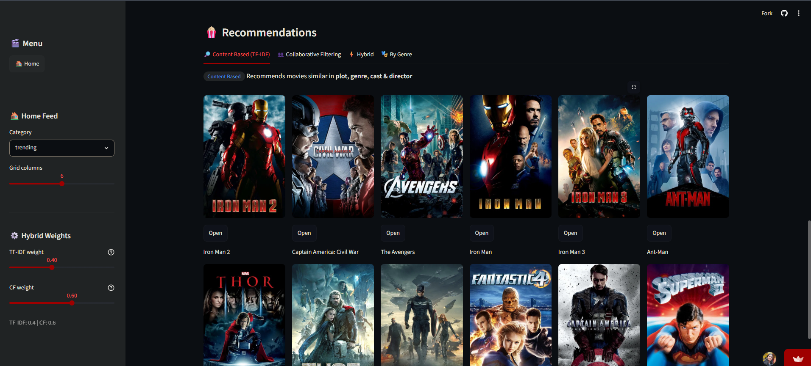
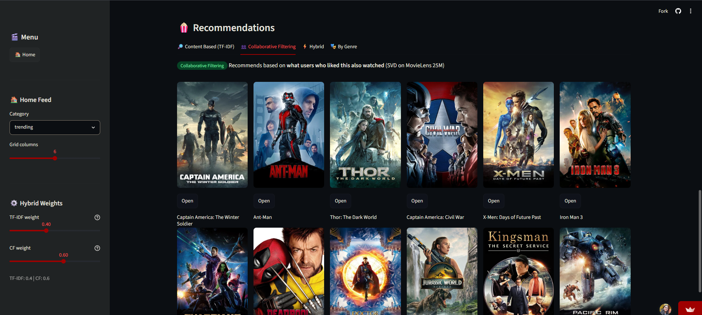
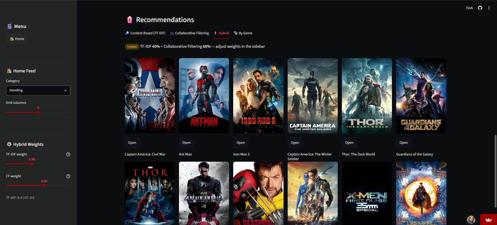

# 🎬 Movie Recommendation System

### TMDB Powered Movie Discovery & Recommendation Engine

---
🚀 Live Demo
Frontend (Streamlit)

https://movie-recommendationsystem-temmjyknfti8gh8n7si9bk.streamlit.app/?view=home

Backend API

https://movie-recommendation-system-r6d3.onrender.com/docs

# 📌 Table of Contents

- [Project Overview](#-project-overview)
- [Business Objectives](#-business-objectives)
- [Data Sources](#-data-sources)
- [Recommendation Engine](#-recommendation-engine)
- [Tech Stack](#-tech-stack)
- [Application](#-application)
- [Project Structure](#-project-structure)
- [How to Run This Project](#-how-to-run-this-project)
- [Author & Contact](#-author--contact)

---


# 📌 Table of Contents

* Project Overview
* Business Objectives
* Data Sources
* Recommendation Engine
* Tech Stack
* Application Features
* Project Structure
* How to Run This Project
* Future Improvements
* Author & Contact

---

# 🎯 Project Overview

This project implements a full-stack Hybrid Movie Recommendation System capable of generating movie suggestions using multiple recommendation strategies.

Users can:

1. Search movies from the TMDB database.
2. Explore trending and popular movies.
3. Get recommendations using Content-Based Filtering.
4. Receive recommendations using Collaborative Filtering.
5. View movie posters, ratings, genres, and metadata.
6. Access recommendations through a FastAPI backend and Streamlit frontend.

---

# 🎯 Business Objectives

## 1. Personalized Movie Discovery

Help users discover movies matching their interests through machine learning-based recommendation techniques.

## 2. Hybrid Recommendation Approach

### Content-Based Filtering

* TF-IDF Vectorization
* Cosine Similarity
* Movie Metadata Analysis

### Collaborative Filtering

* User Rating Analysis
* Matrix Factorization
* Latent Feature Learning

---

# 🗂️ Data Sources

The project uses:

TMDB 5000 Movies Dataset

TMDB 5000 Credits Dataset

MovieLens Ratings Dataset

TMDB API

---

# 🤖 Recommendation Engine

## Content-Based Recommendation

Uses:

* Movie overview
* Genres
* Cast
* Crew
* Keywords

Algorithms:

* TF-IDF Vectorizer
* Cosine Similarity

Model Files:

* tfidf.pkl
* tfidf_matrix.pkl
* indices.pkl

---

## Collaborative Filtering

Uses user rating behavior to discover hidden movie preferences.

Algorithms:

* Matrix Factorization
* Latent Feature Embeddings

Model Files:

* cf_movie_factors.pkl
* cf_movie_ids.pkl
* cf_movies_df.pkl

---

# 🛠️ Tech Stack

## Frontend

* Streamlit

## Backend

* FastAPI
* Uvicorn

## Machine Learning

* Scikit-Learn
* TF-IDF Vectorizer
* Cosine Similarity
* Collaborative Filtering

## Data Processing

* Pandas
* NumPy

## External APIs

* TMDB API

## Deployment

* Streamlit Community Cloud
* Render

---

# 📊 Application Features

* 🎬 Movie Search
* 🔥 Trending Movies
* ⭐ Popular Movies
* 🤖 Content-Based Recommendations
* 👥 Collaborative Filtering Recommendations
* 🎭 Genre-Based Discovery
* 🖼️ TMDB Poster Integration
* ⚡ FastAPI Backend APIs

---
# 📸 Screenshots

## 🏠 Home Page


---

## 🔍 Movie Search


---


## 🤖 Content-Based Recommendations



---

## 👥 Collaborative Filtering Recommendations



---
## 🔥 Hybrid Recommendations



---
## 🔥 Genre based Recommendations


# 📁 Project Structure

Movie_recommendation_system/

├── Data/

├── models/

│ ├── tfidf.pkl

│ ├── tfidf_matrix.pkl

│ ├── indices.pkl

│ ├── df.pkl

│ ├── cf_movie_factors.pkl

│ ├── cf_movie_ids.pkl

│ └── cf_movies_df.pkl

├── Notebooks/

│ ├── content_based.ipynb

│ └── collaborative_method.ipynb

├── images/

├── app.py

├── main.py

├── requirements.txt

└── README.md

---

```md
# 🎮 How to Use

### Step 1

Open the deployed application.

### Step 2

Search for a movie such as:

- Interstellar
- Inception
- The Dark Knight

### Step 3

View movie information including:

- Poster
- Rating
- Genres
- Overview

### Step 4

Generate recommendations using:

- Content-Based Filtering
- Collaborative Filtering

### Step 5

Explore trending and popular movies.

---

# ▶️ How to Run This Project

## 1. Clone Repository

```bash
git clone https://github.com/YOUR_USERNAME/Movie_recommendation_system.git

cd Movie_recommendation_system
```

## 2. Create Virtual Environment

```bash
python -m venv .venv
```

## 3. Activate Virtual Environment

```bash
.venv\Scripts\activate
```

## 4. Install Dependencies

```bash
pip install -r requirements.txt
```

## 5. Create .env File

```env
TMDB_API_KEY=YOUR_API_KEY
```

## 6. Run FastAPI Backend

```bash
uvicorn main:app --reload
```

## 7. Run Streamlit Frontend

```bash
streamlit run app.py
```

---
# 🚀 Future Improvements

* Hybrid Weighted Recommendation Engine
* User Authentication
* Watchlist System
* Recommendation Explanations
* Deep Learning Based Recommendations
* Personalized User Profiles

---

# 👩‍💻 Author & Contact

### Riya Mishra

**GitHub:**  
https://github.com/9056riya

**LinkedIn:**  
https://www.linkedin.com

**Email:**  
riyamishra9056@gmail.com


